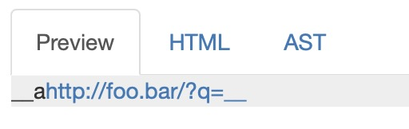
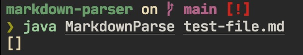
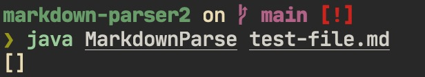
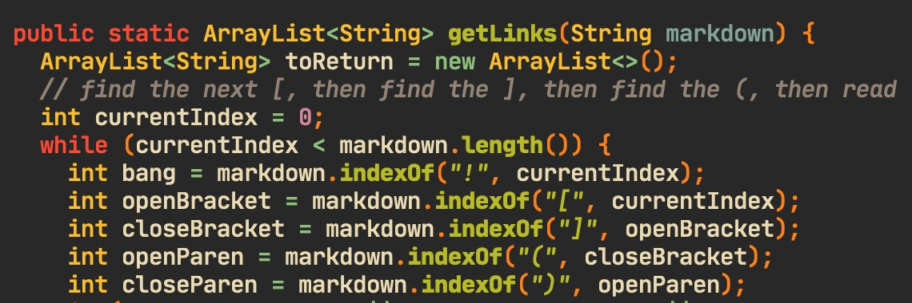
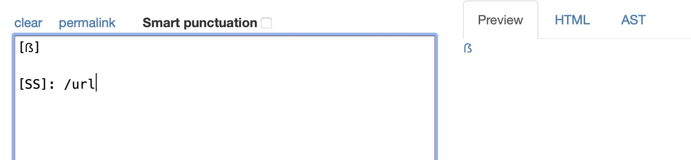
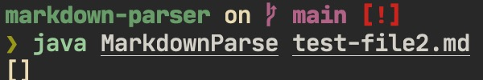
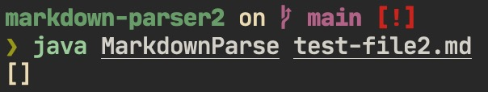
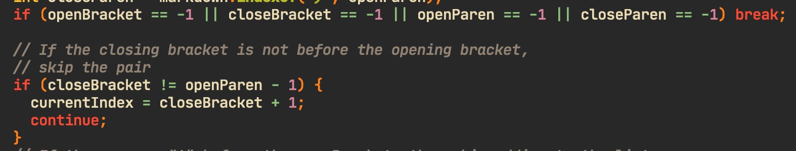

 # Week 10 Lab Report

- I found the tests with different results manually

## Test 1

[Link to failing test file](https://raw.githubusercontent.com/nidhidhamnani/markdown-parser/main/test-files/480.md)

Both implementations were wrong.

Expected output:

Given implementation results:

My implementaiotn results:

The bug in the code is that HTML tags are not recognized as valid links when 
they should be. The code that should be fixed is this part 

It should also include searching for tags inside `<>`, which may contain links.

## Test 2

[Link to failing test file 2](https://raw.githubusercontent.com/nidhidhamnani/markdown-parser/main/test-files/539.md)

Both implementations did not work.

Expected output:

Given implementation results:

My implementation results:

The bug is that link references that are stored later in the document are
not searched for. If a parentheses pair could not be found after a bracket,
the program should search the document for other references. 

This part of the code should be fixed.
