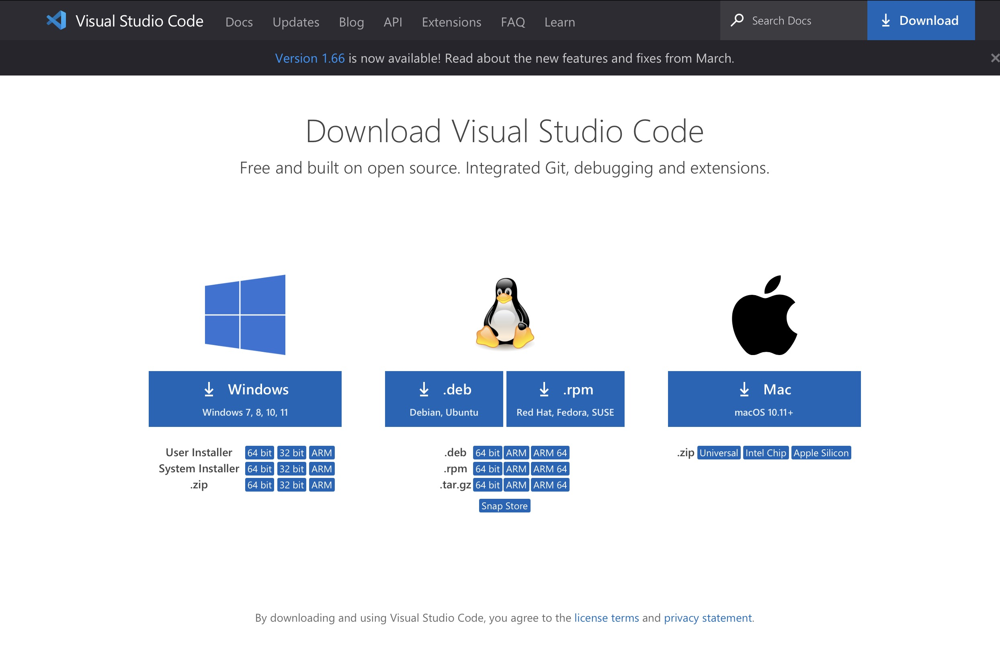
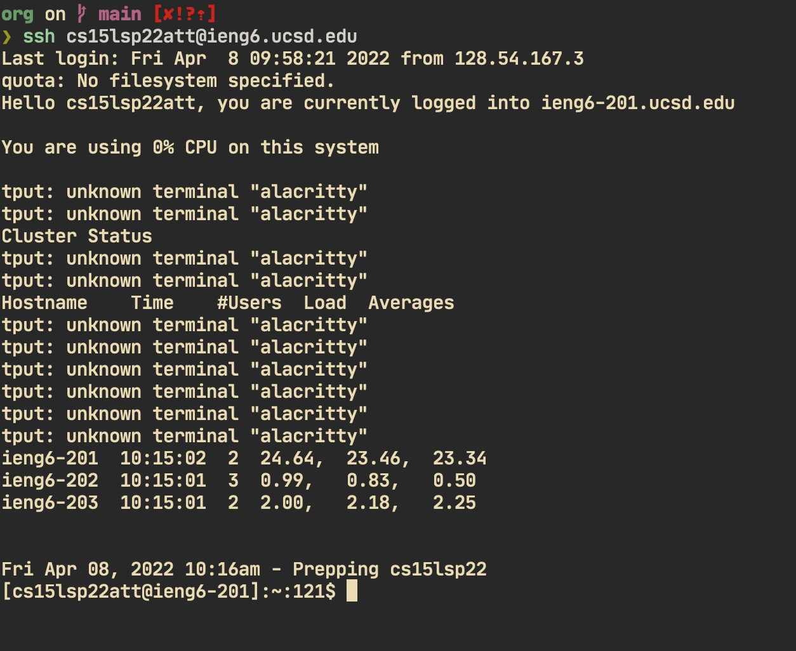
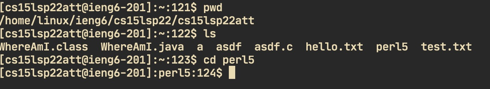
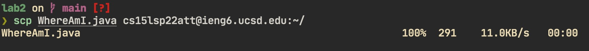
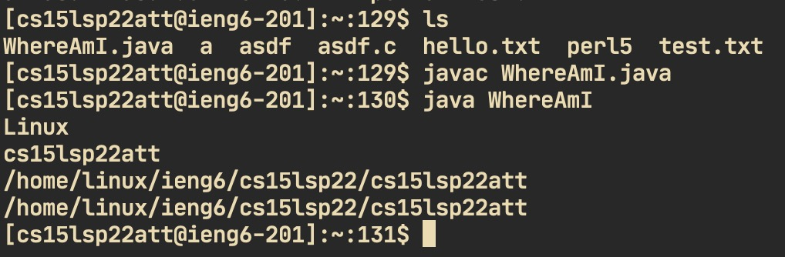
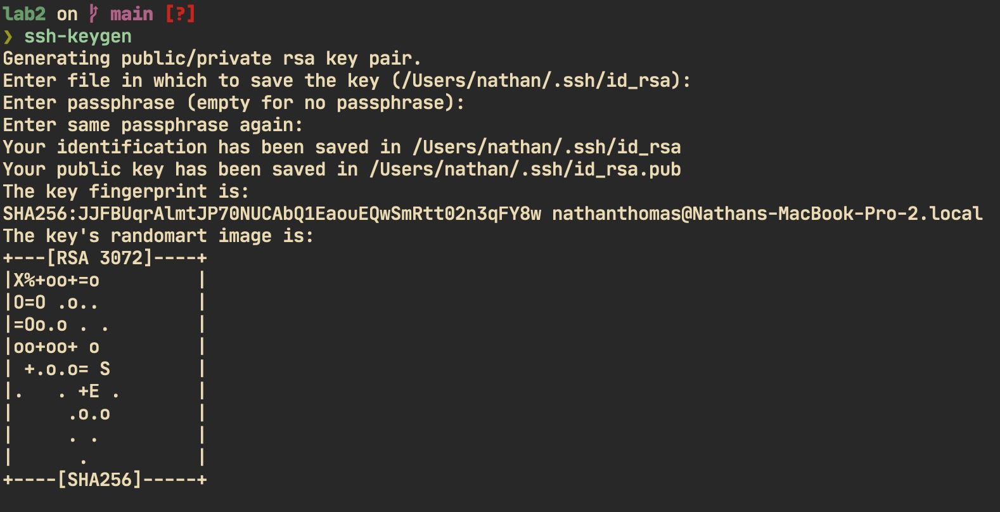
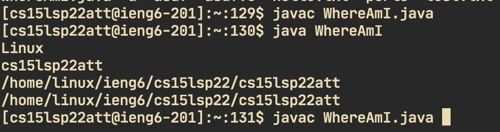

# Week 2 Lab Report

## Installing VScode

- Go to the VSCode website and click download for the appropriate operating system

- Open the downloaded file and follow installation instructions

## Remotely Connecting

- Open the terminal

- Type `ssh <username>@<servername>`

- Type in your AD password

## Trying Some Commands

- Try typing some commands such as `pwd` and `cd`

- `pwd` will print the working directory

- `cd` wil change the working directory

## Moving Files with scp

- You can use the `scp` command to move files from your computer to the
server

- Type `scp <filepath> <username>@<servername>:<filepath in server>`

- Enter the password and the file should copy

## Setting an SSH Key

- Because typing in your password over and over again is inconvenient, we
will use an ssh key to remember your device

- First, type `ssh-keygen` and follow the instructions shown on the
command line

- Then save the file that ends in `.pub` to `~/.shh/authorized_keys` on
the server, and the other files to `~/.ssh` on your local computer

## Optimizing Remote Running

- There are a few shortcuts you should learn in order to make remote
running more convenient

- Use the up/down arrow to cycle through the past commands
