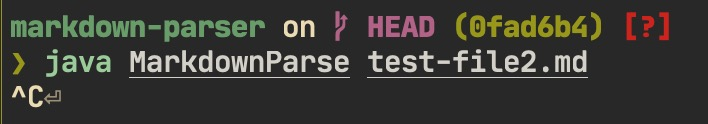

# Week 4 Lab Report

## Fix test-file2

[test-file2.md](https://github.com/nathom/markdown-parser/blob/main/test-file2.md)

### Symptom

When running MarkdownParse on test-file2.md, it causes the program to freeze. The bug was
that the program was not checking if any of the characters did not match, returning `-1`.
This meant that it treated `-1` as a valid index, which basically reset the `currentIndex`
variable, never terminating the loop.

## Fix test-file3

[test-file3.md](https://github.com/nathom/markdown-parser/blob/main/test-file3.md)

### Symptom

The program counts embedded images as links. `should not show` should not have
been detected as a link. The bug was that positions of exclamation marks were
not checked.

## Fix test-file4

[test-file4.md](https://github.com/nathom/markdown-parser/blob/main/test-file4.md)

## Symptom

Instead of returning an empty list, MarkdownParse was returning a list with
length one containing `""`. This was because it was not verifying that the closing
bracket was one position before the opening parenthesis.
