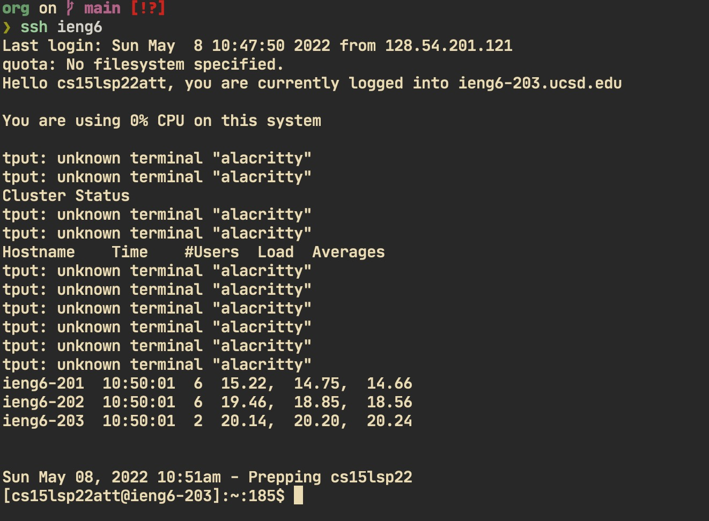
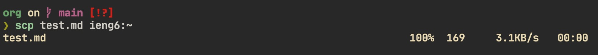
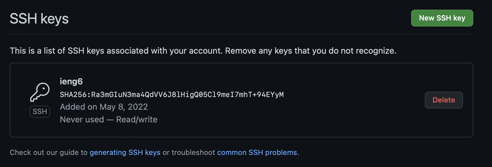
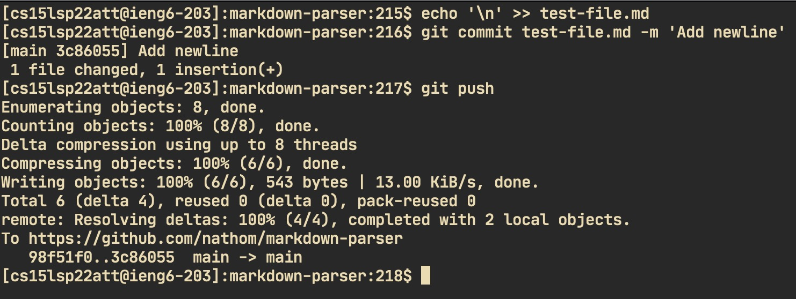
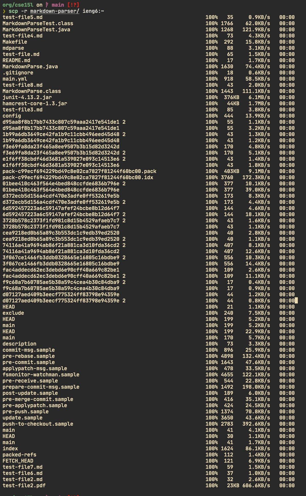
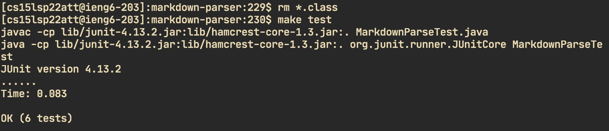
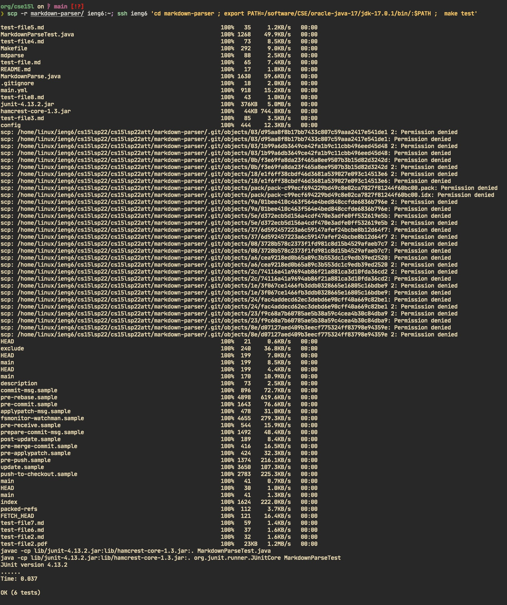

# Lab Report 3

## Streamlining SSH Config

I edited it with vim.

## Setup Github Access from ieng6

Public key on user account is contained in id_ed25519.pub

Public key on GitHub

Commiting and pushing a change on the server

[Link to commit](https://github.com/nathom/markdown-parser/commit/3c860556a1d8ce74aa16c55dccdaeede0d99ac64)

## Copying whole directories with scp -r

Running tests on server

Copy directory and run tests in single command

I had to change `$PATH` because it was not being updated in time when the makefile
was being run.

