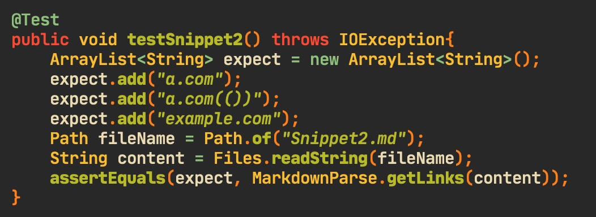

# Week 8 Lab Report

[Reviewed repo](https://github.com/Aaron3963/MarkdownParser)

[My repo](https://github.com/nathom/markdown-parser)

## Snippet 1

Expected output

> "`google.com", "google.com", "ucsd.edu"

### My repo:

Test:

Result:

### Reviewed repo:

Test:

Result:

## Snippet 2

Expected output

> "a.com", "a.com(())", "example.com"

### My repo:

Test:

Result:

### Reviewed repo:

Test:

Result:

## Snippet 3

Expected output

> "https://sites.google.com/eng.ucsd.edu/cse-15l-spring-2022/schedule"

### My repo

Test:

Result:

### Reviewed repo:

Test:

Result:

## Changes to fix bugs

### Snippet 1

It would be a more involved change because you would need to check whether the code
fences are inside the link or outside. This could involve searching backwards, which
my program does not do.

### Snippet 2

Yes, a small solution is possible. For the escaped brackets, you just ignore the brackets if
there is a backslash before the character. For the nested parenthesis, you need to create a
function that counts the opening and closing parentheses to make sure only the outer parenthesis
is counted as marking the end of the link.

### Snippet 3

This would be a more involved change because it needs to account for cases where there
are legal line breaks within links and titles and where a line break ends the parsing
of a link on the line, which invalidates it.
